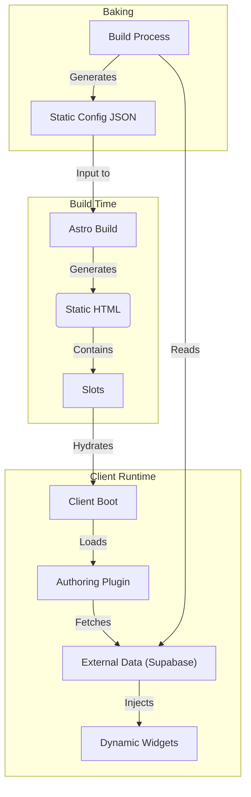

# StoreLayout Extension System Plan

## Overview
This document outlines the plan to enable external content completion in `StoreLayout` using a **Registry-based Widget System**, aligned with the HMI `LayoutContainer` and `widgetRegistry` pattern. This allows products to "snap" extensions into predefined slots using a JSON configuration.

## Goals
1.  **Registry Pattern**: Extensions are registered in a central `ExtensionRegistry`, similar to `src/lib/widgetRegistry.ts`.
2.  **JSON Configuration**: Layout composition is defined via JSON, specifying which extensions go into which slots.
3.  **Opt-Out/Opt-In**: The system is flexible; products can opt-out or override default configurations.
4.  **Extensibility**: Support adding tabs, extending content panes, and enhancing galleries.

## Proposed Architecture

### 1. Extension Registry (`ExtensionRegistry`)
We will create a registry to manage available extensions (widgets).

```typescript
// model/extension/registry.ts (Draft)

export interface ExtensionMetadata {
  id: string;
  name: string;
  description?: string;
  category?: 'tab' | 'panel' | 'gallery' | 'general';
}

export interface ExtensionDefinition {
  component: any; // Astro Component
  metadata: ExtensionMetadata;
}

class ExtensionRegistry {
  private extensions = new Map<string, ExtensionDefinition>();

  register(definition: ExtensionDefinition) {
    this.extensions.set(definition.metadata.id, definition);
  }

  get(id: string) {
    return this.extensions.get(id);
  }
}

export const extensionRegistry = new ExtensionRegistry();
```

### 2. JSON Configuration Schema
The configuration defines the "slots" and the extensions within them. This mimics `LayoutContainer` where a container holds widgets.

```typescript
// JSON Structure
interface ExtensionConfig {
  enabled: boolean; // Opt-out mechanism
  slots: {
    [slotName: string]: ExtensionInstance[]; 
  };
}

interface ExtensionInstance {
  id: string; // Unique instance ID
  extensionId: string; // ID from registry
  props?: Record<string, any>; // Props to pass to the component
  order?: number;
}
```

### 3. Slots in `StoreLayout`
`StoreLayout.astro` will define specific "Hosting Slots" where the registry engine will render content.

| Slot Name | Context | usage |
| :--- | :--- | :--- |
| `tabs` | Tab Navigation Bar | Inject new `TabButton` components |
| `tab-panels` | Tab Content Area | Inject new `TabContent` panels corresponding to new tabs |
| `description` | Main Description Column | Append/Prepend widgets to product description |
| `gallery` | Media Area | Inject additional gallery items or widgets |

### 4. Data Passing & Context
Extensions need access to the product data. We will pass the full product model to all extensions via props.

*   **Context Interface**: The extension component will receive a standard set of props.
    ```typescript
    // model/extension/context.ts
    import type { IStoreItem } from '@/polymech/model/component'; // or appropriate path

    export interface ExtensionContext {
      item: IStoreItem; // The full product data
      slot: string;     // The slot where this extension is rendered
      config?: any;     // Extension-specific configuration
    }
    ```

*   **Prop injection**: The `ExtensionHost` will automatically inject these props.
    ```astro
    // ExtensionHost.astro
    const { slotName, config, item } = Astro.props;
    // ...
    <Component {...instance.props} item={item} slot={slotName} />
    ```

### 5. Implementation Details

#### A. Data Loading
*   **Default Config**: A global config defines default extensions for all products.
*   **Product Config**: Products can provide a specific config (e.g., via `store.extensions.json` or frontmatter) to override or extend defaults.
*   **Merging**: Logic to merge default and product-specific configurations.

#### B. Component Rendering (`ExtensionHost.astro`)
A helper component to render extensions for a given slot.

```astro
---
// components/ExtensionHost.astro
import { extensionRegistry } from '../model/extension/registry';
const { slotName, config, item } = Astro.props;
const extensions = config.slots[slotName] || [];
---
{extensions.map(instance => {
  const customExt = extensionRegistry.get(instance.extensionId);
  const Component = customExt?.component;
  return Component ? <Component {...instance.props} item={item} /> : null; 
})}
```

#### C. Updates to `StoreLayout.astro`
*   Import `ExtensionHost`.
*   Load `ExtensionConfig`.
*   Replace hardcoded sections with or append `ExtensionHost` calls, passing the `item` (which corresponds to `data` props in `StoreLayout`).

**Example:**
```astro
<!-- In StoreLayout.astro -->
<div id="tabs">
  <!-- Existing Tabs -->
  <TabButton title="Overview" />
  ...
  <!-- Extension Tabs -->
  <ExtensionHost slotName="tabs" config={extConfig} item={data} />
</div>
```

## Integration Steps
1.  **Create Registry**: Implement `src/model/extension/registry.ts`.
2.  **Define Config Schema**: Create TypeScript interfaces.
3.  **Implement `ExtensionHost`**: Create the renderer component.
4.  **Register Core Extensions**: Convert some existing optional parts (like "3D Preview") into registered extensions as a proof of concept.
5.  **Update `StoreLayout`**: Integrate `ExtensionHost` into the identified slots.

### 6. Plugin Lifecycle & Authoring (Hybrid Mode)
This system supports a hybrid lifecycle where extensions can be static (baked at build time) or dynamic (loaded at runtime for authoring/personalization).

#### A. Architecture: The "Overlay" Model
The "Authoring Plugin" acts as an overlay on top of the static Astro page.



#### B. Lifecycle Stages

1.  **Static Render (Server-Side)**:
    *   Astro renders the page using `IStoreItem` data.
    *   `ExtensionHost` renders any *statically registered* extensions defined in `store.extensions.json`.
    *   Slots are marked with `data-slot-id` attributes for client-side targeting.

2.  **Client Boot & Hooking**:
    *   The page loads.
    *   The **Authoring User** logs in (or the plugin auto-loads).
    *   The plugin script initializes and "hooks" into the global registry.

3.  **Data Pre-Processing (Client-Side)**:
    *   The plugin intercepts the product data state.
    *   **Hook**: `onProductDataLoaded(item: IStoreItem) => ModifiedItem`
    *   *Example*: The plugin fetches "Draft Review Notes" from Supabase and appends them to `item.notes`.

4.  **Dynamic Widget Injection**:
    *   The plugin registers *new* widgets at runtime or overrides existing ones.
    *   It uses React Portals (or similar) to mount components into the `data-slot-id` DOM nodes.
    *   *Example*: A "Comment/Annotate" widget is injected into the `description` slot.

5.  **Post-Processing & Authoring**:
    *   User interacts with widgets (e.g., adds a new "Draft Tab").
    *   **Save**: Changes are persisted to the external store (Supabase).
    *   **Local State**: The UI updates immediately to reflect the new authoring state.

6.  **"Baking" (Reification)**:
    *   Trigger: A build pipeline runs.
    *   Action: It fetches the finalized state from Supabase.
    *   Transform: Converts the dynamic state into a static `store.extensions.json` file.
    *   Result: The next Astro build includes these changes statically, improving performance and removing the runtime dependency for end-users.
### 7. Risks & Trade-offs (Critique)
While powerful, this "Hybrid/Overlay" architecture introduces significant complexity.

| Risk | Description | Mitigation |
| :--- | :--- | :--- |
| **Hydration Mismatches** | Injecting React components dynamically into server-rendered DOM nodes can cause hydration errors (`Text content does not match server-rendered HTML`). | Use `client:only` for extension hosts or strict boundary isolation (Shadow DOM or specific React Roots). |
| **Performance (CLS)** | Client-side extensions load *after* the initial page, causing Content Layout Shift (CLS) as widgets pop in. | Reserve space with skeletons/placeholders of fixed dimensions. |
| **Performance (LCP)** | Fetching configuration and data from Supabase blocks the "interactive" state, degrading Core Web Vitals. | Cache configurations on the Edge; use aggressive `stale-while-revalidate` strategies. |
| **Vendor Lock-in/Drift** | The "Authoring Plugin" becomes a separate, monolithic app that drifts from the main codebase. | Monorepo integration; share types (`IStoreItem`) strictly between the main app and plugin. |
| **Security (XSS)** | Loading remote configurations that define component props acts as a vector for Cross-Site Scripting if not sanitized. | Strict schema validation (Zod) on all loaded configs; avoid `dangerouslySetInnerHTML`. |
| **Baking Complexity** | The "Baking" pipeline is engineering-heavy: it requires a headless browser or a complex build script to "replay" the dynamic state into static files. | Keep the data model simple (JSON) so baking is just "merging JSONs" rather than "scraping DOM". |
