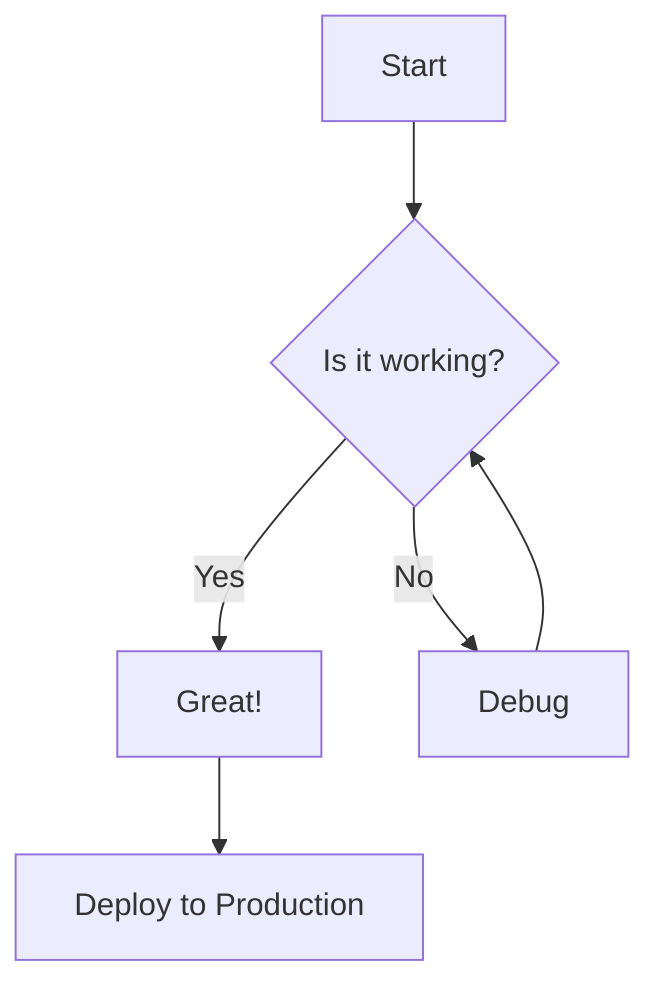
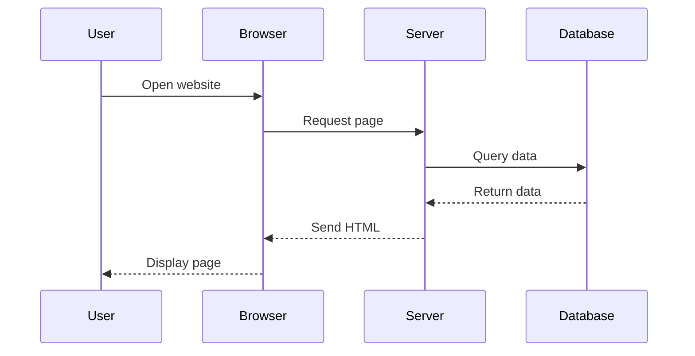
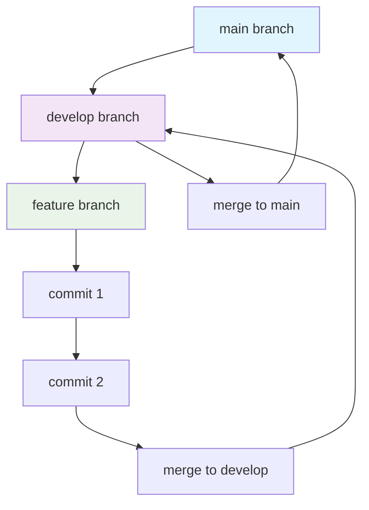
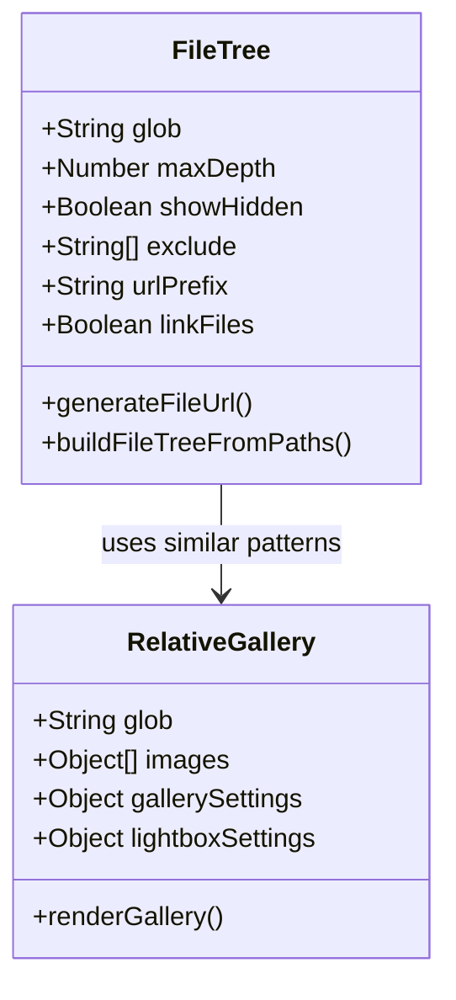
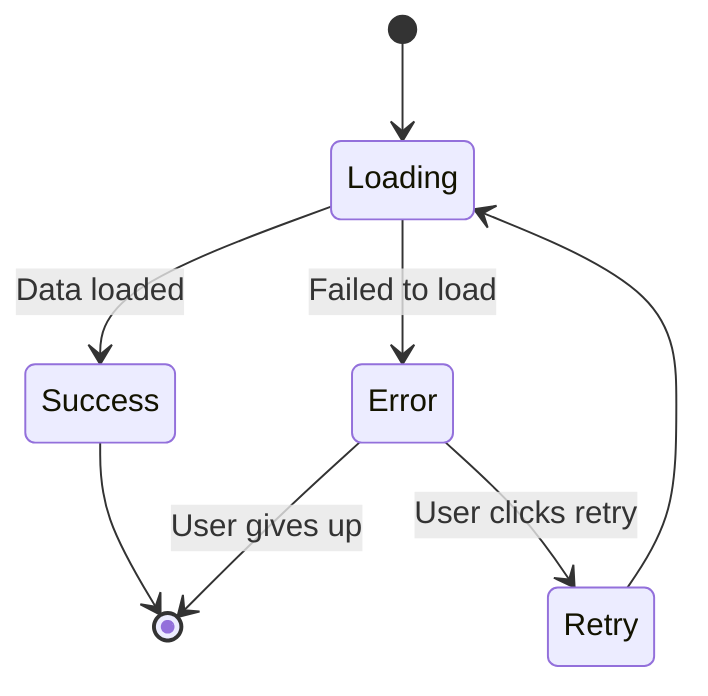
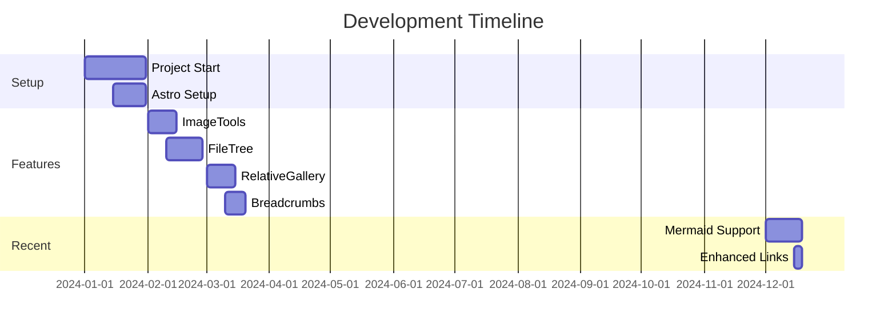

import { Img, Picture } from "imagetools/components";
import LGallery from "@polymech/astro-base/components/GalleryK.astro";
import RelativeImage from "@polymech/astro-base/components/RelativeImage.astro";
import RelativePicture from "@polymech/astro-base/components/RelativePicture.astro";
import RelativeGallery from "@polymech/astro-base/components/RelativeGallery.astro";

import FileTree from "@polymech/astro-base/components/FileTree.astro";

# Test MDX Content

This is a test MDX file with proper frontmatter. It should now appear in your resources collection.

## 🎯 Relative Path Solution for Imagetools

### ✅ NEW: Relative Paths with Custom Wrappers

<RelativeImage src="./test.jpg" alt="Test image with relative path" width={300} />

<RelativePicture src="./test.jpg" alt="Responsive relative image" widths={[600]} />

### 🔄 Two Images Side by Side (50% each)

<div class="image-row">
  <RelativeImage src="./test.jpg" alt="First image" class="floating-image" />
  <RelativeImage src="./test.jpg" alt="Second image" class="floating-image" />
</div>

### 🔄 Original: Public Paths (Still Work)


<Picture src="/images/test.jpg" alt="Responsive Test Image" widths={[600]} />

### Different Format Generation
<Picture src="/images/test.jpg" alt="Multi-format Test Image" width={400} format={["avif", "webp", "jpg"]} />

### Quality Optimization


## Interactive Image Gallery

### 🆕 Glob Pattern Gallery - Auto-load from Directory!

<RelativeGallery 
  glob="./gallery/*.jpg"
  gallerySettings={{ 
    SHOW_TITLE: true,
    SHOW_DESCRIPTION: true 
  }}
/>

### Manual Images (Original Method)

export const galleryImages = [
  {
    src: "./test.jpg",
    alt: "First test image",
    title: "Test Image 1 (Relative)",
    description: "This image uses relative path ./test.jpg"
  },
  {
    src: "./test.jpg", 
    alt: "Second test image",
    title: "Test Image 2 (Relative)", 
    description: "This image uses relative path ./test.jpg"
  }
];

<RelativeGallery 
  images={galleryImages}
  gallerySettings={{
    SHOW_TITLE: true,
    SHOW_DESCRIPTION: true,
    SIZES_REGULAR: "w-full h-auto",
    SIZES_THUMB: "w-32 h-32"
  }}
  lightboxSettings={{
    SHOW_TITLE: true,
    SHOW_DESCRIPTION: true,
    SIZES_LARGE: "w-auto h-auto"
  }}
/>


### 🆕 Glob Pattern Support:

<RelativeGallery 
  glob="./gallery/*.jpg"
  gallerySettings={{ SHOW_TITLE: true }}
/>

### Manual Usage:
```jsx
import RelativeImage from "@polymech/astro-base/components/RelativeImage.astro";
<RelativeImage src="./my-image.jpg" alt="My image" width={400} />
```

## FileTree Component Example

### 🆕 Auto-Generated FileTree with Glob Patterns!

No more manually typing out file structures! Just like RelativeGallery, FileTree now supports glob patterns with **clickable file links**:

<FileTree glob="../**/*.{md,mdx,astro,ts,js,json}" maxDepth={3} />

### Specific Directory Structure (with custom URL prefix)

<FileTree 
  glob="../components/**/*" 
  maxDepth={2} 
  exclude={["node_modules", ".git"]}
  urlPrefix="https://github.com/yourrepo/blob/main"
/>

### VS Code Integration Example

<FileTree 
  glob="../src/components/polymech/**/*.{ts,astro}" 
  maxDepth={2}
  urlPrefix="vscode://file"
/>

### 🆕 Thumbnail View (Windows Explorer Style)

Perfect for browsing images and visual files with **modern, subtle link styling** (no more aggressive blue!):

<FileTree 
  glob="../public/images/**/*.{jpg,jpeg,png,gif,webp,svg}" 
  view="thumbs"
  thumbSize="medium"
  maxDepth={2}
/>

### Large Thumbnails for Detailed Preview

<FileTree 
  glob="../public/products/**/*.{jpg,jpeg,png}" 
  view="thumbs"
  thumbSize="large"
  maxDepth={1}
/>

### Small Thumbnails for Compact View

Debug example with current directory images and proper icons:

<FileTree 
  glob="./gallery/*" 
  view="thumbs"
  thumbSize="medium"
  linkFiles={true}
/>

Mixed content with folders and files:

<FileTree 
  glob="../**/*.{md,ts,json}" 
  view="thumbs"
  thumbSize="small"
  maxDepth={2}
/>

For comparison, here's a tree view of the same files:

<FileTree 
  glob="./*.jpg" 
  view="tree"
  linkFiles={true}
/>

### Debug Example - Non-existent Path

This will show the "No files found" message with absolute path:

<FileTree 
  glob="./non-existent/*.jpg" 
  view="thumbs"
  thumbSize="small"
/>

<FileTree 
  glob="./another-missing-dir/**/*.png" 
  view="tree"
  maxDepth={2}
/>

### Manual FileTree (Original Method)

Here's an example of the FileTree component with manual structure:

<FileTree>

- public/
  - images/
    - logo.svg
    - hero.jpg
  - favicon.ico
- src/
  - components/
    - **Header.astro** Important component
    - Footer.astro
    - Navigation.astro
  - layouts/
    - Layout.astro
  - pages/
    - index.astro
    - about.astro
    - blog/
      - [...slug].astro
  - styles/
    - global.css
- astro.config.mjs
- package.json
- README.md

</FileTree>

### Advanced FileTree Features

<FileTree>

- src/
  - components/
    - ui/
      - Button.tsx React component
      - Input.vue Vue component
      - Modal.svelte Svelte component
    - **layouts/**
      - BaseLayout.astro
      - BlogLayout.astro
  - utils/
    - helpers.ts
    - constants.js
  - types/
    - index.d.ts TypeScript definitions
  - ...
- tests/
  - unit/
    - components.test.ts
  - e2e/
    - homepage.spec.ts
- docs/
  - **getting-started.md** Start here!
  - api-reference.md
- .github/
  - workflows/
    - ci.yml
- package.json
- tsconfig.json

</FileTree>

### More Glob Examples

Show just the current directory:
<FileTree glob="./*" />

Show all TypeScript files in the project:
<FileTree glob="../**/*.ts" maxDepth={4} />

Show configuration files only:
<FileTree glob="../**/*.{json,yaml,yml,toml,config.js,config.ts}" maxDepth={2} />

### FileTree Usage Examples

```jsx
// Tree view (default) - hierarchical structure
<FileTree glob="../src/**/*.astro" maxDepth={3} />

// Thumbnail view - Windows Explorer style grid
<FileTree 
  glob="../public/images/**/*.{jpg,png,gif}" 
  view="thumbs"
  thumbSize="medium"
/>

// Large thumbnails for detailed preview
<FileTree 
  glob="../assets/**/*.{jpg,png}" 
  view="thumbs"
  thumbSize="large"
  maxDepth={2}
/>

// Small thumbnails for compact display
<FileTree 
  glob="../gallery/**/*" 
  view="thumbs"
  thumbSize="small"
  linkFiles={false}
/>

// Custom URL prefix for GitHub integration
<FileTree 
  glob="../**/*.ts" 
  urlPrefix="https://github.com/username/repo/blob/main"
  maxDepth={3} 
/>

// VS Code integration - files open in editor
<FileTree 
  glob="../**/*.astro" 
  urlPrefix="vscode://file"
  maxDepth={2} 
/>

// Disable links if you just want display
<FileTree 
  glob="../**/*" 
  linkFiles={false}
  maxDepth={2} 
/>

// Show hidden files with custom dev server URL
<FileTree 
  glob="../**/*" 
  showHidden={true} 
  urlPrefix="http://localhost:3000"
  maxDepth={2} 
/>

// Manual structure (original way - no links)
<FileTree>
- src/
  - components/
    - Header.astro
</FileTree>
```

### View Modes:

- **Tree View** (`view="tree"`): Traditional hierarchical file tree with folders and files
- **Thumbnail View** (`view="thumbs"`): Grid layout like Windows Explorer with image previews

### Thumbnail Sizes:

- **Small** (`thumbSize="small"`): 80px thumbnails for compact display
- **Medium** (`thumbSize="medium"`): 120px thumbnails (default)
- **Large** (`thumbSize="large"`): 160px thumbnails for detailed preview

### Link Types Supported:

- **Default**: `file://` protocol for local file system
- **VS Code**: `vscode://file/` for opening in VS Code
- **GitHub**: `https://github.com/user/repo/blob/main/` for web viewing
- **Custom**: Any URL prefix you provide
- **Disabled**: Set `linkFiles={false}` for display only

## Breadcrumb Navigation

The Resources collection now includes automatic breadcrumb navigation! 

### Features:
- **Auto-generated**: Breadcrumbs are automatically created based on your URL path
- **Smart labeling**: Uses your page title for the current page, formatted directory names for paths
- **Accessible**: Full ARIA support with proper labels and navigation structure
- **Responsive**: Mobile-friendly design that adapts to smaller screens
- **Customizable**: Easy to disable per page or customize styling

### Usage:

**Enable breadcrumbs (default behavior):**
```yaml
---
title: "My Page Title"
# Breadcrumbs will show automatically
---
```

**Disable breadcrumbs for a specific page:**
```yaml
---
title: "My Page Title" 
breadcrumb: false
---
```

### Example Breadcrumb Path:
For a page at `/resources/guides/getting-started/`, the breadcrumb would show:
```
Home / Resources / Guides / Getting Started
```

The breadcrumb component is reusable and can be easily integrated into other collection layouts as needed.

## 🆕 Sidebar Autogenerated Nodes with Sorting

The sidebar now supports configurable sorting for autogenerated nodes! By default, all autogenerated sidebar sections use **alphabetical sorting**.

### Available Sort Functions:

1. **`'alphabetical'`** (Default): Sorts items alphabetically by label, with files before groups
2. **`'date'`**: Sorts by `pubDate` frontmatter field (newest first), fallback to alphabetical
3. **`'custom'`**: Use your own custom sorting function

### Configuration Examples:

#### Basic Alphabetical Sorting (Default)
```typescript
// src/config/sidebar.ts
export const sidebarConfig: SidebarGroup[] = [
  {
    label: 'Resources',
    autogenerate: { 
      directory: 'resources',
      collapsed: false,
      sortBy: 'alphabetical'  // This is the default
    },
  },
];
```

#### Date-based Sorting (Newest First)
```typescript
{
  label: 'Blog Posts',
  autogenerate: { 
    directory: 'blog',
    collapsed: false,
    sortBy: 'date'  // Requires pubDate in frontmatter
  },
}
```

#### Custom Sorting Function
```typescript
{
  label: 'Custom Sorted',
  autogenerate: { 
    directory: 'docs',
    collapsed: false,
    sortBy: 'custom',
    customSort: (a, b) => {
      // Custom logic here - example: prioritize certain files
      if (a.label.startsWith('Getting Started')) return -1;
      if (b.label.startsWith('Getting Started')) return 1;
      return a.label.localeCompare(b.label);
    }
  },
}
```

### Features:

- **Hierarchical sorting**: Applies to both files and subdirectories
- **Files before groups**: Files always appear before subdirectory groups in alphabetical mode
- **Fallback support**: Date sorting falls back to alphabetical when no dates are available
- **Deep nesting**: Sorting applies recursively to all nested levels
- **Type safety**: Full TypeScript support with proper type definitions

### Migration:

Existing configurations will continue to work unchanged - alphabetical sorting is now the explicit default instead of being hardcoded.

## Mermaid Diagrams

Now we have full support for Mermaid diagrams in MDX! Here are some examples:

### Flowchart Example



### Sequence Diagram



### Git Flow Diagram



### Class Diagram



### State Diagram



### Project Timeline

