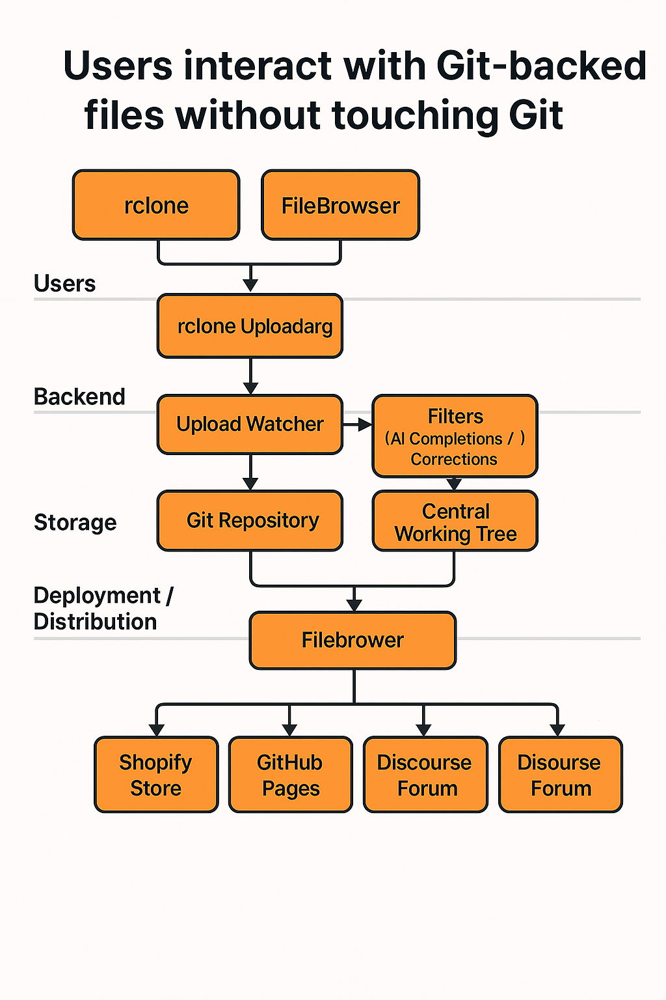
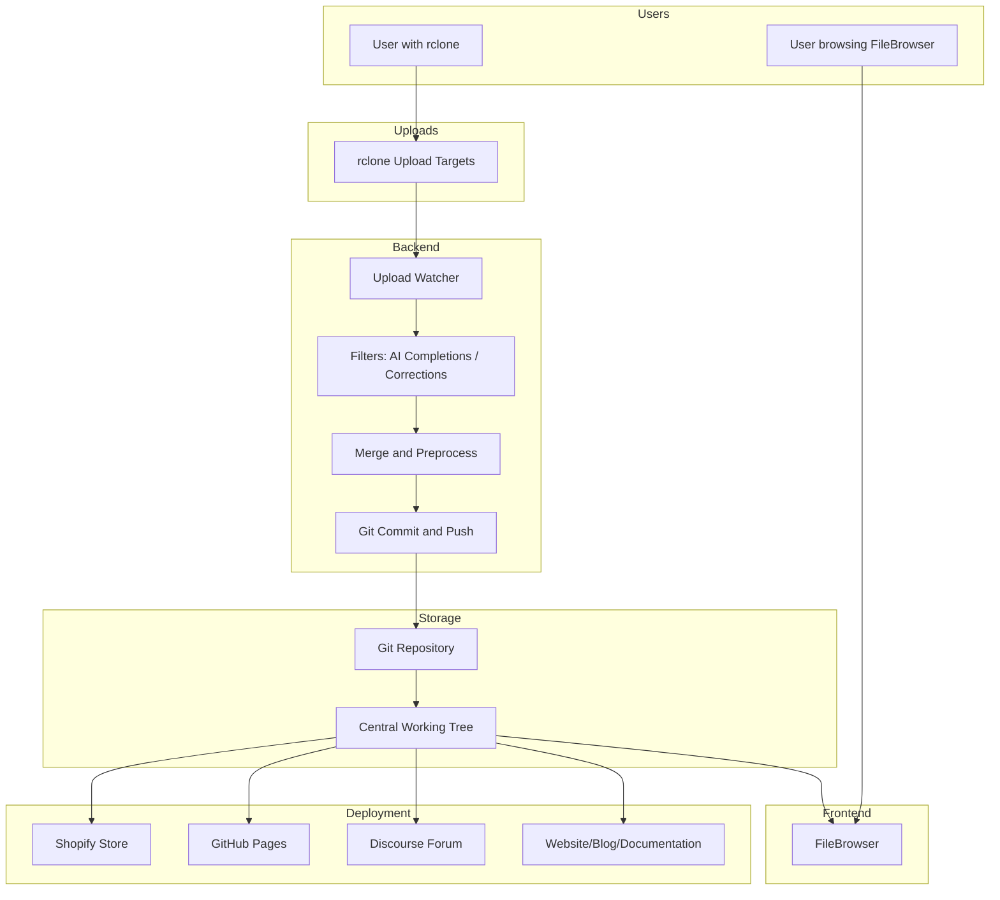

---
---

# Open Source Hardware Collaboration Stack

## 🔍 Overview

This document outlines an architecture designed to support open hardware collaboration. The core idea: **hide Git from users** while leveraging it for backend versioning and storage. Users interact via intuitive tools like FileBrowser or rclone, with automation handling file ingestion, validation, and publishing.

## 🧠 Architecture Summary

- **Git** is the authoritative backend, storing all revisions and metadata.
- **FileBrowser** offers read-only access to hardware project files.
- **rclone** allows users to submit files via various cloud providers (e.g., Google Drive).
- **Automation scripts** ingest submissions, validate them, and merge into Git.
- **Optional filters** like AI-based metadata or filename corrections enrich the submission.
- **Output is distributed** via platforms like Shopify, GitHub Pages, or Discourse forums.

---

## 🎯 Audience

### 🔧 Admins

- Deploy and maintain FileBrowser, Gitea, and rclone remotes.
- Set up secure and scalable upload targets.
- Configure sync scripts and ensure error logging.

### 🔌 Integrators

- Customize and extend the pipeline for your workflow.
- Plug in AI filters, add CI tools, integrate with business systems.
- Provide hooks to trigger actions after commit (e.g., notify, publish).

### 👨‍💻 Developers

- Use Git (via Gitea) to manage core repositories.
- Review and curate auto-submitted hardware projects.
- Develop plugins or filters for specialized file formats (e.g., KiCAD, STEP).

### 🧰 End-Users (Small Biz / Creators)

- Download designs directly from FileBrowser.
- Upload updated or new projects using rclone (e.g., from Google Drive).
- Do **not** need Git, GitHub, or CLI knowledge.

---

## 🗂️ File Flow Diagram

---

## 🧭 Component Roles

### 📁 FileBrowser

- Web-based UI for browsing project files.
- Can be read-only or auth-gated.

### 🔀 rclone

- CLI sync tool supporting many backends (GDrive, Dropbox, S3, etc).
- Used by creators to push their project updates.

### 👀 Watcher

- Cron job or `inotify`-based script watching upload folders.
- Can filter invalid/malicious uploads.

### 🧠 AI Filters (Optional)

- Clean file/folder names.
- Auto-fill metadata.
- Detect file structure issues.

### 🔄 Merge and Preprocess

- Normalize project structure.
- Generate missing files (README, manifest).
- Validate formats.

### 🗃️ Git Commit / Push

- Commits are added with default author (e.g., bot).
- Pushed to central Gitea instance.

### 🌐 Distribution Targets

- Shopify: sell hardware kits or components.
- GitHub Pages: publish docs or showcases.
- Discourse: post releases, changelogs, discussions.

---

## 🖼️ Infographic Summary

> Will be included as an image below. Represents the stack as layers:
>
> - User interaction: rclone & FileBrowser
> - Sync & Ingest: rclone uploads → watcher → filters → Git
> - Core: Git (Gitea) and working tree
> - Output: Distribute to store, forum, docs

---

Let me know if you'd like Docker Compose examples, scripts for watcher/commit, or to integrate more endpoints like email feedback or CI pipelines.

## 🔁 Alternatives

While FileBrowser + rclone + Gitea forms a minimal, robust stack, other tools can be used depending on your needs.

### 🌐 Web Interfaces

- **Pydio Cells**
  - Full-featured web file manager with modern UI and sharing tools.
  - Advanced access control, audit logs, and integration options.
  - Suitable as a drop-in replacement for FileBrowser.

- **Nextcloud**
  - Open-source private cloud with file sync, sharing, and app ecosystem.
  - Excellent for teams needing document collaboration (comments, versioning).
  - Integrates well with Git, rclone, and hardware-friendly plugins.

### 📁 Sync & Storage

- **Syncthing**
  - Decentralized peer-to-peer file sync.
  - Great for edge devices or air-gapped contributors.

- **Seafile**
  - Lightweight, versioned file storage solution.
  - Better performance than Nextcloud in many use cases.

### 🧠 Automation / Processing

- **Woodpecker CI**
  - Lightweight CI system to process incoming hardware files (e.g., validate KiCad, generate 3D previews).

- **OpenBuildService (OBS)**
  - For packaging and distributing hardware-related software.

### 🧵 Distributed/Decentralized Tools

- **Radicle**
  - Peer-to-peer Git alternative with built-in collaboration.

- **IPFS + OrbitDB**
  - Store and version design files on decentralized networks.

These alternatives can be mixed and matched depending on whether you prioritize simplicity, decentralization, or enterprise features.
